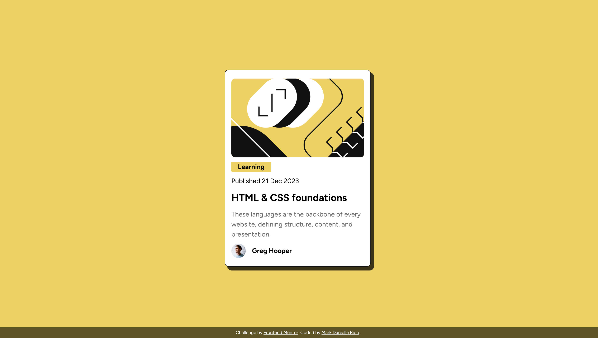

# Frontend Mentor - Blog preview card solution

This is a solution to the [Blog preview card challenge on Frontend Mentor](https://www.frontendmentor.io/challenges/blog-preview-card-ckPaj01IcS). Frontend Mentor challenges help you improve your coding skills by building realistic projects.

## Table of contents

- [Overview](#overview)
  - [The challenge](#the-challenge)
  - [Screenshot](#screenshot)
  - [Links](#links)
- [My process](#my-process)
  - [Built with](#built-with)
  - [What I learned](#what-i-learned)
- [Author](#author)

## Overview

- This is a challenge from Frontend Mentor to learn and apply skills after studying HTML and CSS.

### The challenge

- The main challenge I encountered is properly styling the card, the box shadow, and making it responsive for mobile view.

### Screenshot



### Links

- Solution URL: https://github.com/markbien/blog-preview-card-main
- Live Site URL: https://htmlpreview.github.io/?https://github.com/markbien/blog-preview-card-main/blob/main/index.html

## My process

### Built with

- Semantic HTML5 markup
- CSS custom properties
- Flexbox

### What I learned

It is important to always make the page responsive so that users can view the webpage via mobile, tablet, and/or desktop and the appearance shouldn't break.

I used this code:

````css
.card {
  width: min(350px, 90%);
}
````
## Author
- Frontend Mentor - @markbien https://www.frontendmentor.io/profile/markbien